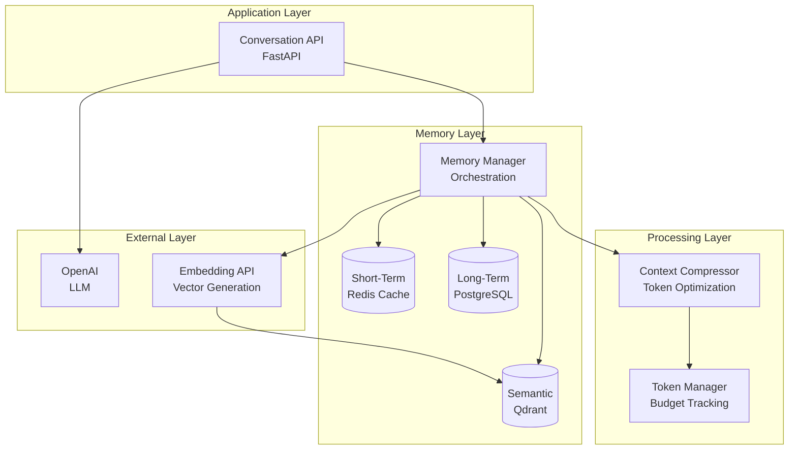

# Conversational AI: Context Management in Long Conversations

**Complete Conversational AI system** with hierarchical memory, automatic context compression, and semantic search. Maintains coherence over 50+ turns while reducing token usage by 60-85% through incremental summarization and intelligent compression.

> **Note**: This is a tutorial/blog project. Code can be refactored freely without backward compatibility concerns.

## Overview

Traditional conversational AI systems lose context as conversations get longer, forcing you to either truncate conversations or pay exponentially more for larger models. This system implements hierarchical memory with three layers—short-term (Redis), long-term (PostgreSQL), and semantic (Qdrant)—enabling long conversations while reducing token costs significantly.

## Architecture



## Key Features

### Core Memory Capabilities

- **Hierarchical Memory**: Three-layer system—short-term (recent turns), long-term (summarized history), semantic (vector search)
- **Incremental Summarization**: Summaries created every 10 turns, enabling progressive compression
- **Automatic Compression**: Monitors token budget, compresses when context exceeds 80% threshold
- **Semantic Search**: Vector embeddings enable cross-session memory retrieval
- **Token Budgeting**: Accurate token counting and budget allocation prevent overruns

### Production Features

- **Constraint Management**: Extracts and applies user preferences, corrections, and rules
- **Health Checks**: Comprehensive health endpoints with dependency status
- **Metrics**: Prometheus metrics for token usage, memory retrieval, and conversation stats
- **Error Handling**: Graceful degradation for non-critical failures
- **Qdrant Compatibility**: REST API implementation for Qdrant 1.7.0 compatibility

## Quick Start

### Prerequisites

- Docker and Docker Compose
- OpenAI API Key
- 4GB+ RAM (for PostgreSQL, Redis, Qdrant)
- Python 3.11+

### 1. Clone and Setup

```bash
cd tutorials/conversational-ai-context-management

# Create .env file with your OpenAI API key
echo "OPENAI_API_KEY=your_key_here" > .env
```

### 2. Start Services

```bash
docker compose up -d
```

This starts:

- PostgreSQL (long-term memory storage)
- Redis (short-term memory cache)
- Qdrant (semantic memory vector database)
- Conversational AI Service (main API)
- Prometheus (monitoring)

### 3. Test the System

```bash
# Start a conversation
curl -X POST http://localhost:8006/api/conversations \
  -H "Content-Type: application/json" \
  -d '{
    "user_id": "user-1",
    "message": "My name is Alice and I like Python programming"
  }'

# Continue conversation (should remember name)
curl -X POST http://localhost:8006/api/conversations/{conversation_id}/messages \
  -H "Content-Type: application/json" \
  -d '{
    "message": "What did I tell you about my name?"
  }'
```

## Project Structure

```
conversational-ai-context-management/
├── app/
│   ├── api/
│   │   └── health.py              # Health check utilities
│   ├── core/
│   │   ├── config.py              # Application configuration
│   │   ├── dependencies.py        # Service container & DI
│   │   └── exceptions.py          # Custom exceptions
│   ├── models/
│   │   ├── conversation.py        # Conversation models
│   │   ├── memory.py              # Memory state models
│   │   ├── constraints.py         # Constraint models
│   │   └── response.py            # API response models
│   ├── services/
│   │   ├── memory_manager.py      # Hierarchical memory orchestration
│   │   ├── semantic_memory.py     # Qdrant vector search
│   │   ├── context_compressor.py  # Token compression logic
│   │   ├── token_manager.py       # Token counting and budgeting
│   │   ├── constraint_manager.py  # User preference extraction
│   │   ├── database.py            # PostgreSQL operations
│   │   ├── embedding.py           # Embedding generation
│   │   └── llm.py                 # LLM service
│   ├── monitoring/
│   │   └── metrics.py             # Prometheus metrics
│   └── conversation_service.py    # Main conversation orchestration
├── docker/
│   └── postgres/
│       └── init.sql               # Database initialization
├── docs/
│   ├── architecture.md            # System architecture and data flows
│   └── guides.md                  # Setup, deployment, troubleshooting
├── frontend/                       # Next.js frontend UI
├── scripts/                        # Test and utility scripts
├── docker-compose.yml              # Service orchestration
├── Dockerfile                      # Service container
└── README.md                       # This file
```

## API Endpoints

### Conversation API (`http://localhost:8006`)

- **`POST /api/conversations`**: Start a new conversation
- **`POST /api/conversations/{conversation_id}/messages`**: Send a message
- **`GET /api/conversations/{conversation_id}`**: Get conversation details
- **`GET /api/conversations/{conversation_id}/memory`**: Get memory state
- **`GET /health`**: Health check with dependency status
- **`GET /ready`**: Readiness probe (Kubernetes)
- **`GET /metrics`**: Prometheus metrics

## Configuration

Key environment variables (see `.env.example`):

- **OPENAI_API_KEY** (required): OpenAI API key
- **POSTGRES_URL**: PostgreSQL connection string
- **REDIS_URL**: Redis cache URL
- **QDRANT_URL**: Qdrant vector database URL
- **LLM_MODEL**: OpenAI model (default: `gpt-4o-mini`)
- **EMBEDDING_MODEL**: Embedding model (default: `text-embedding-3-small`)

## How It Works

### Memory Layers

1. **Short-Term (Redis)**: Last 10 turns, fast access, session-based
2. **Long-Term (PostgreSQL)**: Summarized conversation ranges, persistent
3. **Semantic (Qdrant)**: Vector search for relevant past conversations

### Context Compression

- Monitors token budget (default: 4000 tokens total)
- Triggers compression when context exceeds 80% of budget
- Preserves system messages (summaries, semantic results)
- Compresses older conversation messages while keeping recent half

### Summary Creation

- Created every 10 turns (configurable)
- Validated against user constraints
- Stored in PostgreSQL and indexed in Qdrant
- Enables cross-session memory retrieval

## Performance

- **Token Reduction**: 60-85% for conversations 50+ turns
- **Memory Retrieval**: <500ms for typical queries
- **Summary Creation**: 1-3 seconds every 10 turns
- **Max Conversation Length**: 50+ turns with maintained coherence

## Limitations

- **Qdrant Version**: Tested with Qdrant 1.7.0 (uses REST API for compatibility)
- **Redis TTL**: Short-term memory expires after 1 hour (configurable)
- **Summary Interval**: Summaries created every 10 turns (configurable)
- **Compression Threshold**: Compression triggers at 80% of token budget (configurable)

## Additional Documentation

- **[docs/architecture.md](docs/architecture.md)**: How the system works - architecture and data flows
- **[docs/guides.md](docs/guides.md)**: Setup, deployment, and troubleshooting
- **[frontend/README.md](frontend/README.md)**: Frontend setup and usage

## License

MIT
