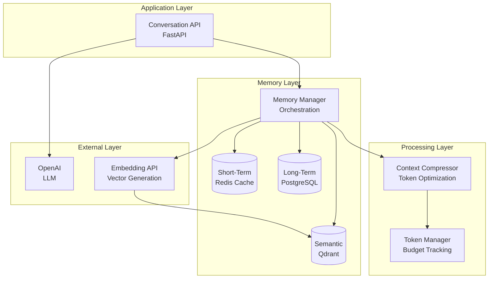
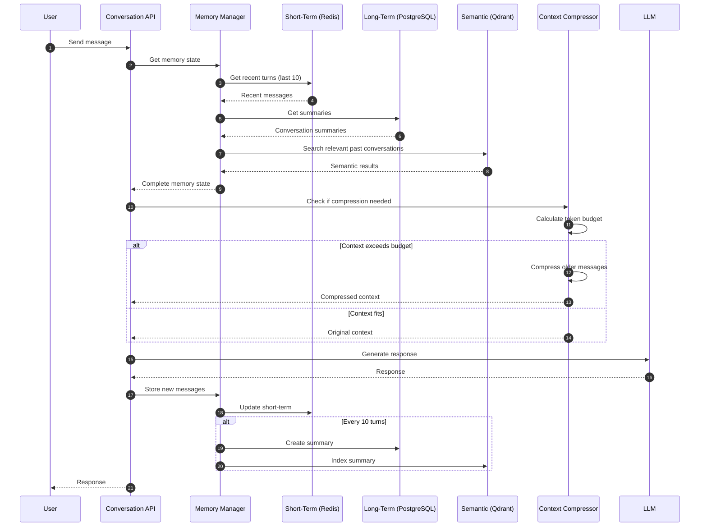
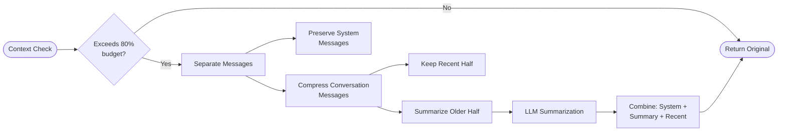
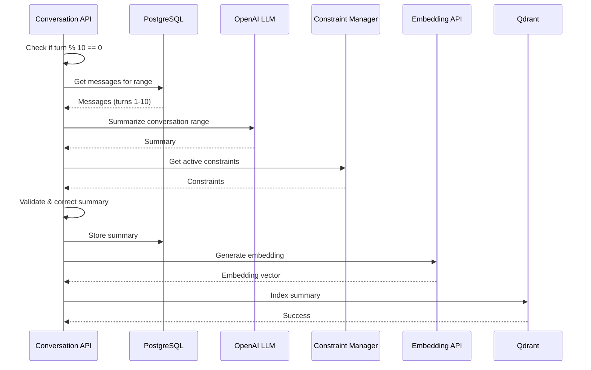

# How It Works: Architecture & Data Flow

This guide explains how the Conversational AI Context Management system maintains coherence over 50+ turns while reducing token usage by 60-85% through hierarchical memory, automatic compression, and semantic search.

## System Architecture

The system uses a three-layer memory architecture with automatic context compression to handle long conversations efficiently:



### Key Components

- **Conversation API**: Handles user messages, orchestrates memory retrieval, manages responses
- **Memory Manager**: Coordinates three memory layers, retrieves context, manages state
- **Short-Term Memory (Redis)**: Fast access to last 10 turns, session-based caching
- **Long-Term Memory (PostgreSQL)**: Persistent summaries of conversation ranges, compressed history
- **Semantic Memory (Qdrant)**: Vector search for relevant past conversations, cross-session context
- **Context Compressor**: Reduces token usage when context exceeds budget, preserves system messages
- **Token Manager**: Tracks token usage, calculates budgets, ensures limits aren't exceeded

## Conversation Flow: How Messages Are Processed

When a user sends a message, here's what happens:



### Step-by-Step Process

1. **Message Received**: User sends a message to the Conversation API
2. **Memory Retrieval**: Memory Manager retrieves context from three layers:
   - **Short-term**: Last 10 turns from Redis (fast, session-based)
   - **Long-term**: Summaries from PostgreSQL (compressed history)
   - **Semantic**: Relevant past conversations from Qdrant (cross-session context)
3. **Context Building**: Messages are assembled in order: long-term summaries → semantic results → short-term messages → current message
4. **Token Budget Check**: Token Manager calculates if context exceeds 80% of available budget
5. **Compression (if needed)**: Context Compressor preserves system messages (summaries, semantic results) and compresses older conversation messages
6. **Response Generation**: LLM generates response with compressed context
7. **Memory Update**: New messages stored in short-term memory (Redis)
8. **Summary Creation (every 10 turns)**: Conversation range is summarized, stored in PostgreSQL, and indexed in Qdrant for semantic search

### Why This Works

- **Hierarchical Memory**: Three layers serve different purposes—recent context (fast), compressed history (efficient), relevant past (personalized)
- **Incremental Summarization**: Summaries created every 10 turns, enabling progressive compression without re-summarizing entire conversation
- **Automatic Compression**: Monitors token budget and compresses only when needed, preserving important system messages
- **Semantic Search**: Vector embeddings enable cross-session memory retrieval, improving personalization

## Memory Layer Details

### Short-Term Memory (Redis)

Stores the last N turns (default: 10) in Redis for fast access:

- **Purpose**: Immediate context without database queries
- **Storage**: Redis with TTL (default: 1 hour)
- **Access**: Fast, in-memory retrieval
- **Limitation**: Only recent turns, session-based

```python
# Stores last 10 messages per conversation
cache_key = f"conversation:{conversation_id}:messages"
await redis_client.rpush(cache_key, json.dumps(message))
await redis_client.ltrim(cache_key, -10, -1)  # Keep last 10
```

### Long-Term Memory (PostgreSQL)

Stores summarized conversation ranges in PostgreSQL:

- **Purpose**: Compressed history of older conversation turns
- **Storage**: PostgreSQL with turn range tracking
- **Creation**: Every 10 turns (configurable)
- **Structure**: Each summary covers a turn range (e.g., turns 1-10, 11-20)

```python
# Summary covers a range of turns
summary = {
    "summary": "Compressed conversation text",
    "turn_range_start": 1,
    "turn_range_end": 10,
    "compressed_tokens": 150
}
```

### Semantic Memory (Qdrant)

Stores vector embeddings of summaries for similarity search:

- **Purpose**: Cross-session context retrieval, relevant past conversations
- **Storage**: Qdrant vector database
- **Indexing**: Summaries are embedded and indexed automatically
- **Search**: Vector similarity search retrieves relevant past conversations

```python
# Search for relevant past conversations
results = await semantic_memory.search_relevant_conversations(
    query_embedding=query_embedding,
    user_id=user_id,
    limit=5,
    min_score=0.7
)
```

## Context Compression Flow

When context exceeds 80% of token budget, compression is triggered:



### Compression Strategy

1. **Preserve System Messages**: Summaries and semantic results are always preserved
2. **Compress Conversation Messages**: Only user/assistant messages are compressed
3. **Keep Recent Half**: Most recent 50% of conversation messages are kept as-is
4. **Summarize Older Half**: Older 50% are summarized using LLM
5. **Combine**: System messages + summary + recent messages = compressed context

## Token Budget Management

Token budget is allocated across three categories:

- **System Prompt**: 200 tokens (default)
- **Response**: 1000 tokens (default)
- **Context**: 2800 tokens (default, out of 4000 total)

The Token Manager:

- Uses tiktoken for accurate token counting
- Calculates available budget per turn
- Triggers compression when context exceeds 80% threshold
- Tracks total token usage for cost monitoring

## Summary Creation Process

Every 10 turns (configurable), a summary is created:



### Summary Validation

Summaries are validated against active constraints:

- **User Preferences**: Extracted preferences are preserved
- **Corrections**: User corrections are applied
- **Rules**: Defined rules (metrics, dashboard meanings) are respected

## Tech Stack

| Component             | Technology                      | Purpose                              |
| --------------------- | ------------------------------- | ------------------------------------ |
| **API Framework**     | FastAPI                         | REST API endpoints                   |
| **Short-Term Memory** | Redis                           | Fast access to recent turns          |
| **Long-Term Memory**  | PostgreSQL                      | Persistent summaries                 |
| **Semantic Memory**   | Qdrant                          | Vector search for past conversations |
| **Embeddings**        | OpenAI `text-embedding-3-small` | Vector generation                    |
| **LLM**               | OpenAI `gpt-4o-mini`            | Response generation, summarization   |
| **Token Counting**    | tiktoken                        | Accurate token counting              |
| **Monitoring**        | Prometheus                      | Metrics tracking                     |

## Key Principles

- **Hierarchical Memory**: Three layers serve different purposes—recent (fast), compressed (efficient), semantic (personalized)
- **Incremental Summarization**: Summaries created every 10 turns, enabling progressive compression
- **Automatic Compression**: Monitors token budget and compresses only when needed
- **System Message Preservation**: Summaries and semantic results are always preserved during compression
- **Cross-Session Memory**: Semantic search enables retrieval of relevant past conversations
